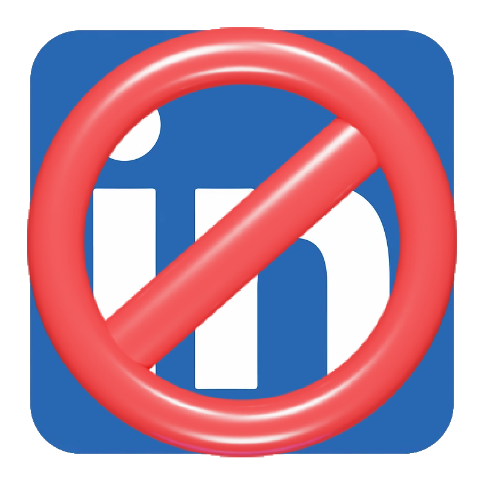
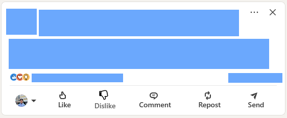
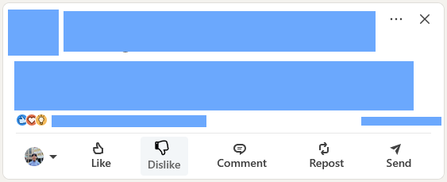
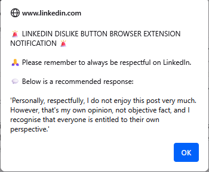
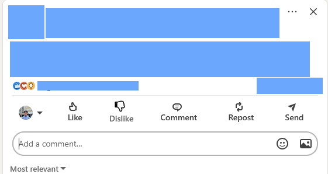
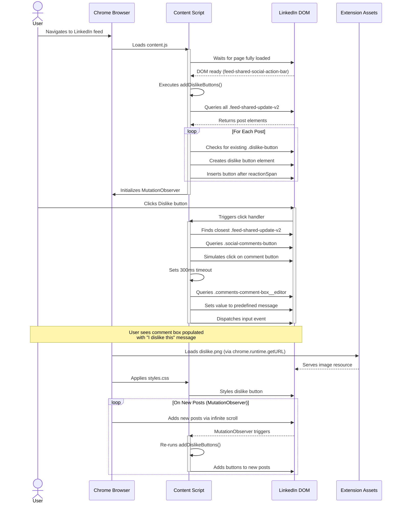

[](https://github.com/gongahkia/linkedin-dislike-button/releases/tag/1.0.0) 

# `LinkedIn Dislike Button`

<p align="center">
    
</p>

We've all heard the phrase, "*[If nothing good to say, don't say](#part-1-ive-never-heard-this-phrase-in-my-life)*". So react instead.

`LinkedIn Dislike Button` is a wholesome and harmless browser extension that does exactly [what it says on the tin](#screenshots).

Also ***please note*** the [satire disclaimer](#usage).

## Stack

* *Frontend*: HTML, CSS
* *Backend*: JavaScript

## Screenshots

### Added Dislike Button

<div style="display: flex; justify-content: space-between;">
  
  
</div>

### Respectfulness Alert



### Opened Comment Dialog



## Usage

> [!IMPORTANT]  
> Using `Linkedin Dislike Button` means you acknowledge that this repository is meant as a piece of ***SATIRE***.  
>  
> Please find the word defined below.  
>  
> * [Merriam Webster](https://www.merriam-webster.com/dictionary/satire)  
> * [Oxford English Dictionary](https://www.oed.com/dictionary/satire_n?tl=true)  
> * [Cambridge Dictionary](https://dictionary.cambridge.org/dictionary/english/satire)  


1. Clone the repository.

```console
$ git clone https://github.com/gongahkia/linkedin-dislike-button
```

Then follow the below instructions for your browser.

### Firefox

1. Copy and paste this link in the search bar *about:debugging#/runtime/this-firefox*.
2. Click *load temporary add-on*.
3. Open the `linkedin-dislike-button` repo, select `manifest.json`.
4. Open [LinkedIn](https://www.linkedin.com/feed/).

### Chrome

1. Copy and paste this link in the search bar *chrome://extensions/*.
2. Toggle *Developer mode* on.
3. Click *load unpacked*.
4. Open the `linkedin-dislike-button` repo, click *select*.
5. Open [LinkedIn](https://www.linkedin.com/feed/).

Support for other browsers like Opera, Vivaldi have not been extensively tested, but this extension should work. Open an issue for further support.

## Architecture



## Reference

### Part 1: I've never heard this phrase in my life

Perhaps you've heard one of its many variations as listed below.

* "*[If you have nothing nice to say, don't say anything at all](https://www.reddit.com/r/unpopularopinion/comments/kn0k1k/the_saying_if_you_have_nothing_nice_to_say_dont/).*"
* "*[If you have nothing nice to say, don’t say it at all](https://medium.com/publishous/if-you-have-nothing-nice-to-say-dont-say-it-at-all-3691aa7bdce8).*"
* "*[If you can't say anything nice, don't say anything at all](https://www.linkedin.com/pulse/you-cant-say-anything-nice-dont-all-jessica-joan-richards-smmxe/).*"
* "*[If you have nothing good to say, remain silent](https://www.facebook.com/muftimenk/posts/if-you-have-nothing-good-to-say-remain-silent-each-time-you-open-your-mouth-to-s/10159055816881971/).*"
* "*[When you don’t have anything good to say, keep your mouth shut](https://www.insidetreasures.com/when-you-dont-have-anything-good-to-say-keep-your-mouth-shut).*"
* "*[If you can’t say something nice, don’t say anything at all](https://www.govloop.com/community/blog/if-you-cant-say-something-nice-dont-say-anything-at-all/).*"
* "*[If you don't have something nice to say, don't say anything at all.](https://www.quora.com/The-saying-goes-If-you-dont-have-something-nice-to-say-dont-say-anything-at-all-Is-this-good-advice).*"

### Part 2: Going down the literal rabbit hole

Upon further research, I was surprised to discover that the original phrase appears to be attributed to [Thumper](https://bambi.fandom.com/wiki/Thumper), a rabbit and the best friend of [Bambi](https://bambi.fandom.com/wiki/Bambi_(Character)) from the Classic [Disney](https://bambi.fandom.com/wiki/Walt_Disney) Animated Film, [Bambi](https://bambi.fandom.com/wiki/Bambi_(Film)).  

Thumper sings about it in the song [If You Can't Say Something Nice](https://bambi.fandom.com/wiki/If_You_Can%27t_Say_Something_Nice), of which the referenced excerpt can be found [here](https://youtu.be/9fYngTUZeUQ?feature=shared).

<div align="center">
    
</div>
